# XAdmin

项目框架及后端基于 [Full Stack FastAPI Template](https://github.com/fastapi/full-stack-fastapi-template) 二次开发。

前端基于 [BuildAdmin](https://github.com/build-admin/buildadmin) 二次开发。

## 技术栈和特性

- ⚡ [**FastAPI**](https://fastapi.tiangolo.com) 用于Python后端API。
  - 🧰 [SQLModel](https://sqlmodel.tiangolo.com) 用于Python和SQL数据库的集成（ORM）。
  - 🔍 [Pydantic](https://docs.pydantic.dev) FastAPI的依赖项之一，用于数据验证和配置管理。
  - 💾 [PostgreSQL](https://www.postgresql.org) 作为SQL数据库。
- 🚀 [Vue](https://vuejs.org) 用于前端。
  - 💃 使用了TypeScript、Vite和其他一些现代化的前端技术栈。
  - 🎨 [Element Plus](https://element-plus.org) 用于前端组件。
  - 📊 [AntV](https://antv.antgroup.com) 用于可视化组件。
  - 🤖 一个自动化生成的前端客户端。
  - 🦇 支持暗黑主题（Dark mode）。
- 🐋 [Docker Compose](https://www.docker.com) 用于开发环境和生产环境。
- 🔒 默认使用密码哈希来保证安全。
- 🔑 JWT (JSON Web Token) 令牌和 Oauth2 用于权限验证。
- ✅ 单元测试用了 [Pytest](https://pytest.org)。
- 📞 [Traefik](https://traefik.io) 用于反向代理和负载均衡。

### 登录页

[](https://github.com/Xingwd/xadmin)

### 主页

[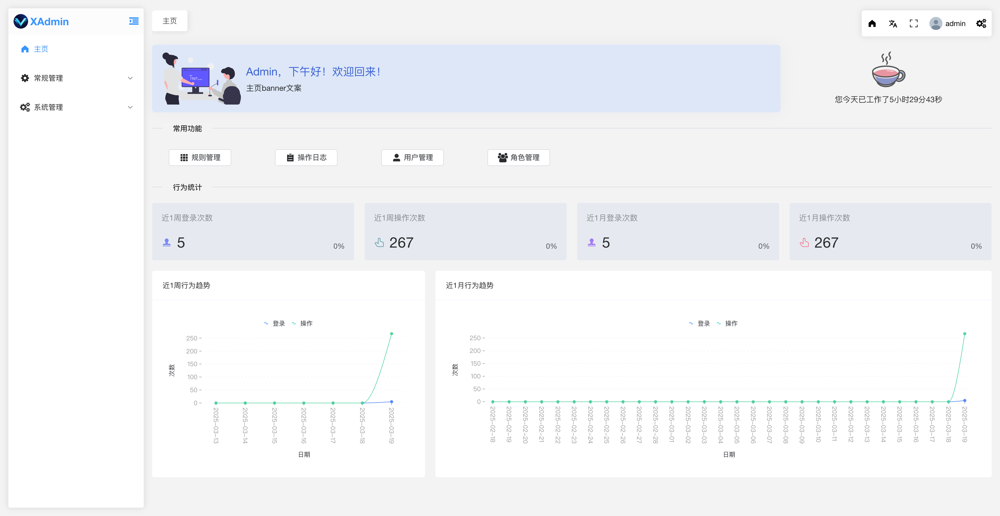](https://github.com/Xingwd/xadmin)

[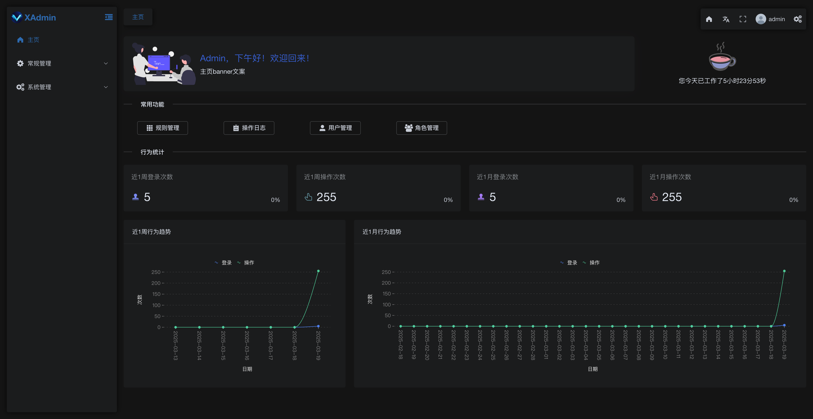](https://github.com/Xingwd/xadmin)

### 布局配置

[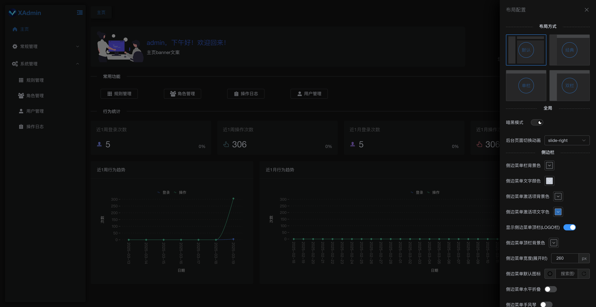](https://github.com/Xingwd/xadmin)

### 常规管理 - 个人信息

[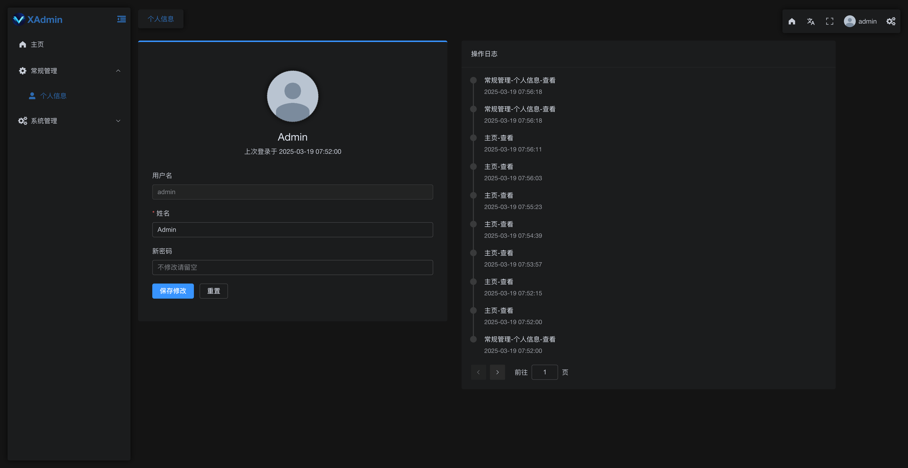](https://github.com/Xingwd/xadmin)

### 系统管理 - 规则管理

[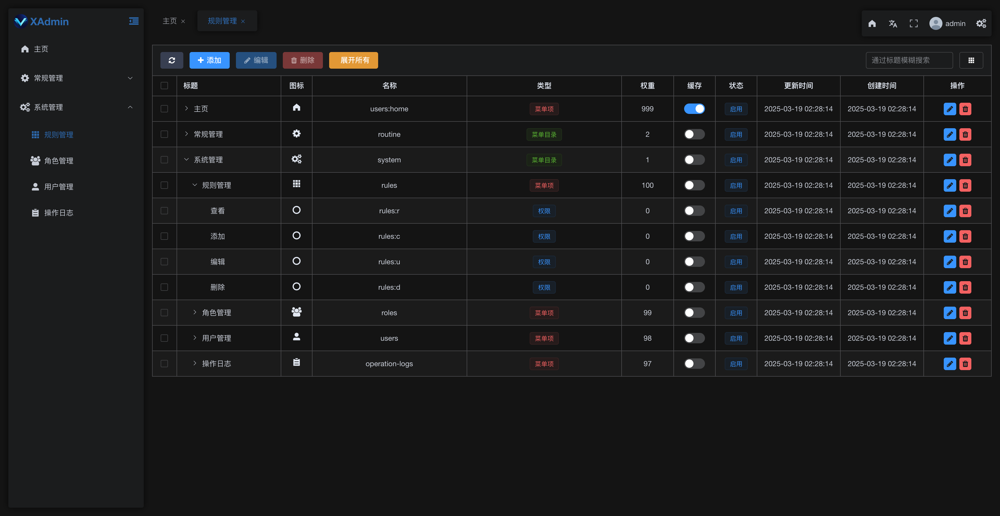](https://github.com/Xingwd/xadmin)

[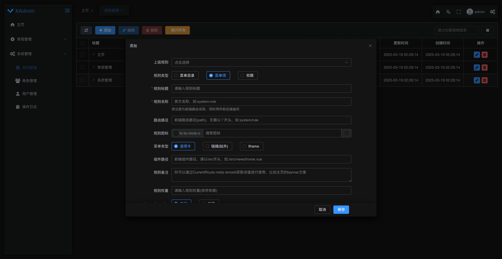](https://github.com/Xingwd/xadmin)

[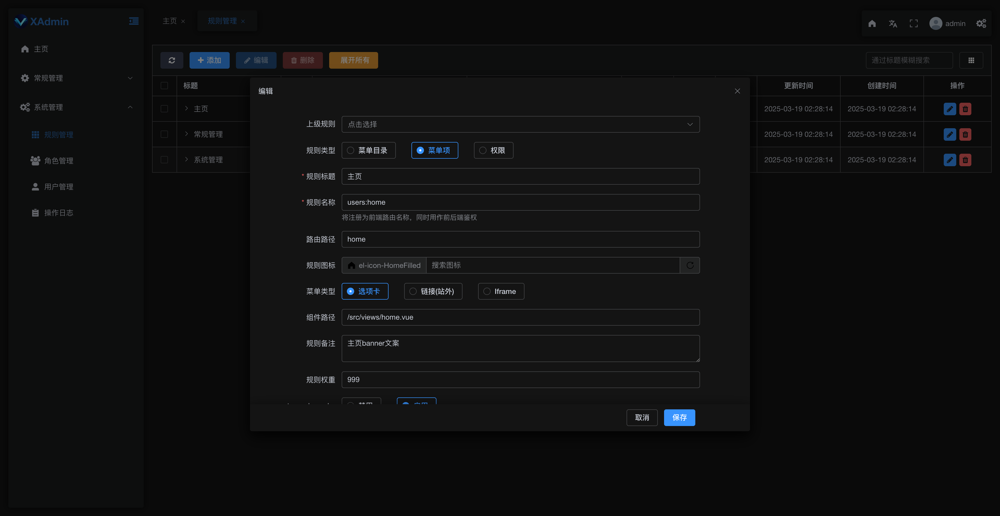](https://github.com/Xingwd/xadmin)

### 系统管理 - 角色管理

[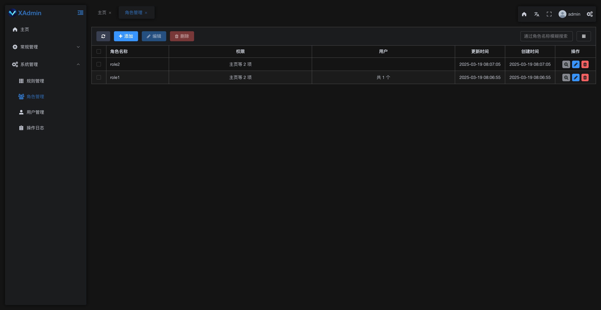](https://github.com/Xingwd/xadmin)

[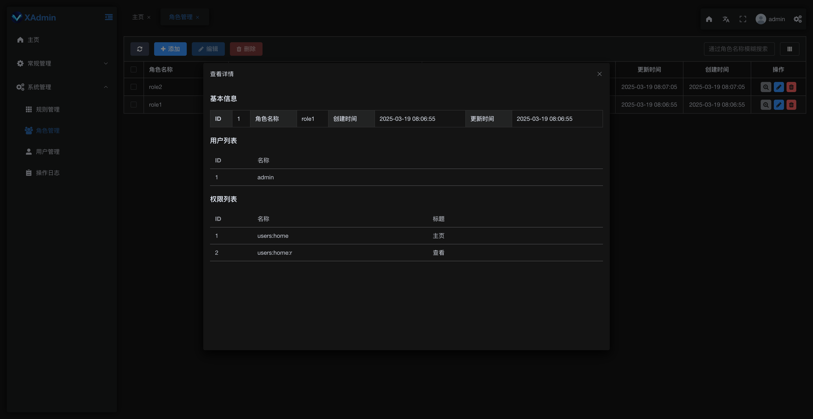](https://github.com/Xingwd/xadmin)

[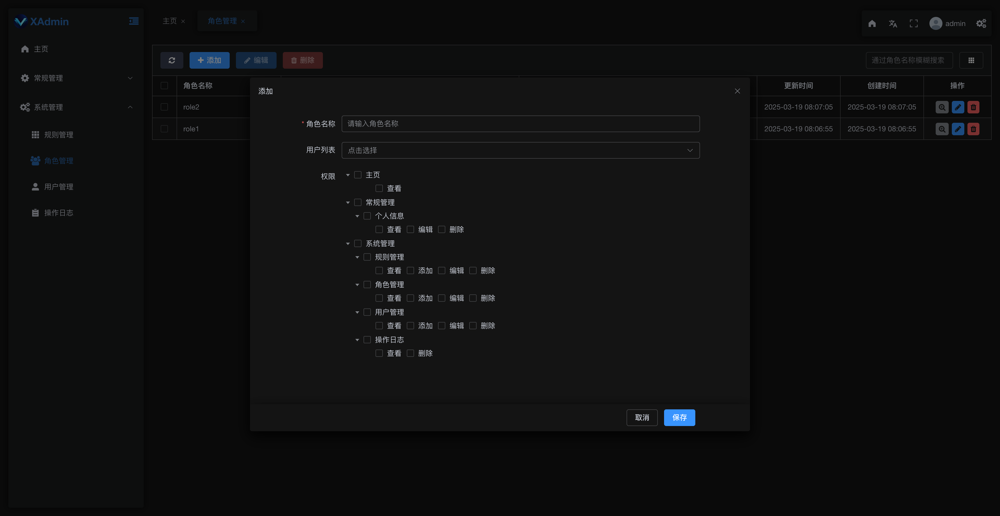](https://github.com/Xingwd/xadmin)

[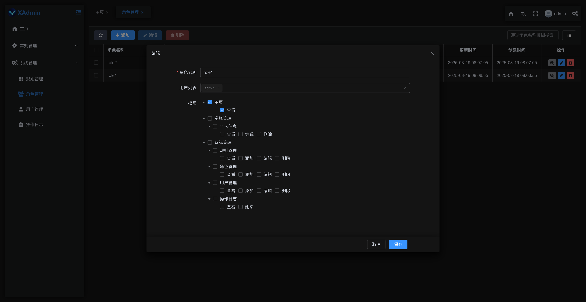](https://github.com/Xingwd/xadmin)

### 系统管理 - 用户管理

[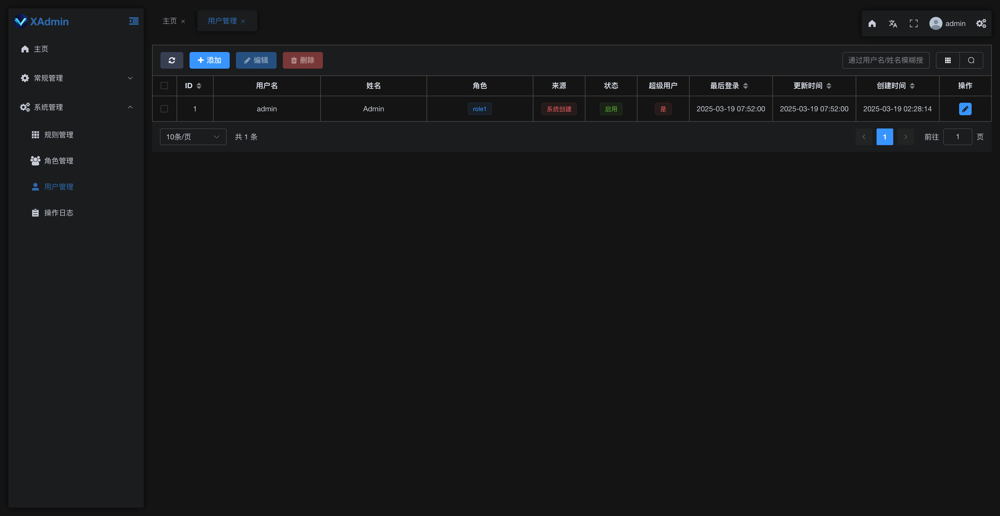](https://github.com/Xingwd/xadmin)

[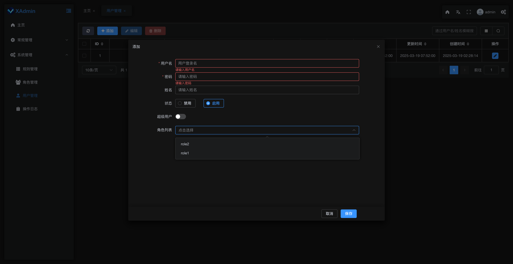](https://github.com/Xingwd/xadmin)

[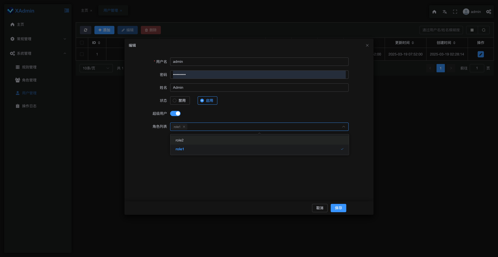](https://github.com/Xingwd/xadmin)

### 系统管理 - 操作日志

[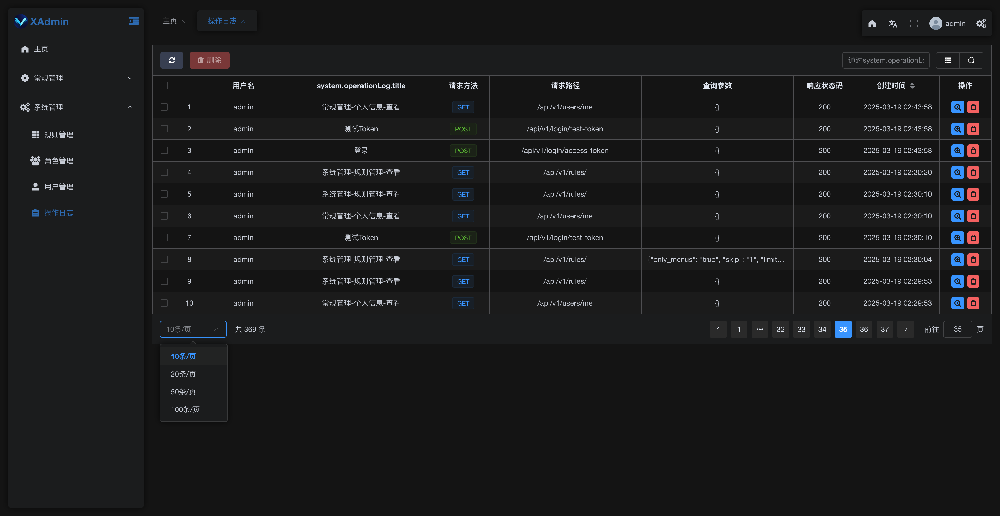](https://github.com/Xingwd/xadmin)

### 交互式 API 文档

[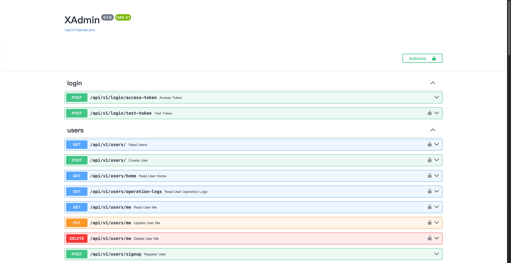](https://github.com/Xingwd/xadmin)

### 配置

你可以更新 `.env` 文件中的配置，以自定义你的配置。

在部署之前，请确保至少更改以下值：

- `SECRET_KEY`
- `FIRST_SUPERUSER_PASSWORD`
- `POSTGRES_PASSWORD`

你可以（并且应该）以环境变量的形式传递这些机密内容。

阅读 [deployment.md](./deployment.md) 文档以了解更多详细信息。

### 生成 Secret Keys

`.env` 文件中的一些环境变量的默认值为 `changethis`。

你必须用一个密钥来更改它们，要生成密钥，你可以运行以下命令：

```bash
python -c "import secrets; print(secrets.token_urlsafe(32))"
```

复制内容并将其用作密码/密钥。然后再次运行以生成另一个安全密钥。

## 后端开发

后端文档：[backend/README.md](./backend/README.md).

## 前端开发

前端文档：[frontend/README.md](./frontend/README.md).

## 通用开发

通用开发文档：[development.md](./development.md).

这包括使用 Docker Compose、自定义本地域、`.env` 配置等。

## 部署

部署文档：[deployment.md](./deployment.md).

## License

XAdmin 依据 MIT license 获得授权。
